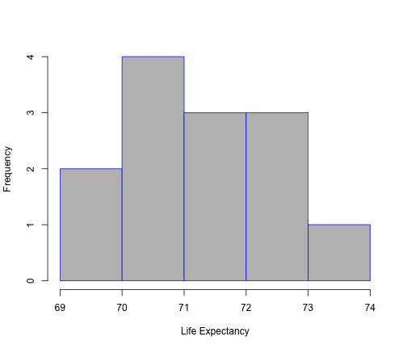

## US States Data

This App allows the user to examine data about US States through histograms

The data can be examined by the following regions which can be selected by the user:

- Northeast
- South
- North Central
- West

---

## Examination of Different Measures

The different measurements that can be examined are:

- Population
- Income
- Illiteracy rates
- Life Expectancy
- Number of Murders
- High School Graduates
- Frost
- Area

The next two slides provide examples of histograms that can be displayed

---

## Populations in the Northeastern states

 

---

## Life Expectancy in the Western states

 

